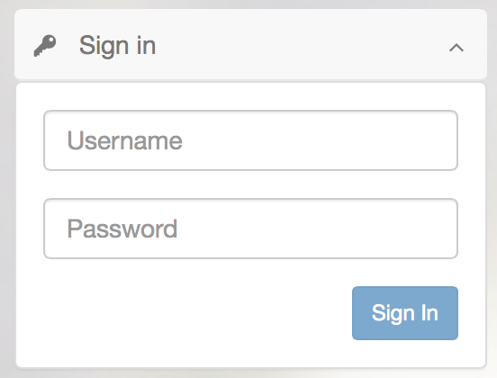

# Simple Login
Provides the ability to login using simple authentication.

## Information
|  name |  version |  bundle |
|--|:--:|--:|
|  widget-login |  2.2.8 |  Universal |

## Dependencies

- base ^2.9.0
- core ^2.12.4
- ui ^2.4.15

## Dev Dependencies

- mock ^1.0.9
- config ^3.4.0
- theme-default ^1.0.12
- angular-mocks ~1.2.28
- requirejs ~2.1.20

## Preferences

- **redirect**: Redirect URL - url to redirect after success login

## Screenshots

## Events
This widget does not publish or subscribe to any events.

