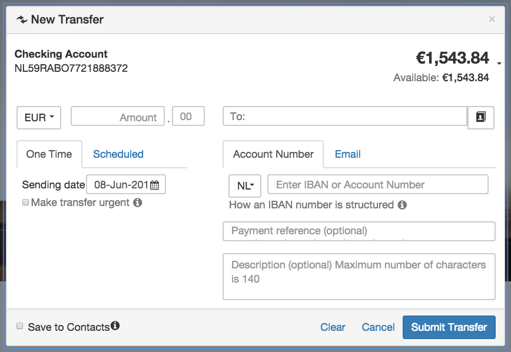

# New Transfer
Provide the ability to transfer money. Different types of money transfer are supported: Direct, Address book, and P2P.
It allows the transfer of funds from one bank account to another and supports several different payment types, simple SEPA, US transfer, international transfer, etc. Depending on the locale of the widget, different payment types may be offered.

## Information
|  name |  version |  bundle |
|--|:--:|--:|
|  widget-new-transfer |  3.2.10 |  Banking |

## Dependencies

- base 2.x
- core 2.x
- ui ^2.8.0
- module-accounts 2.x
- module-contacts 1.x
- module-p2p ^1.0.0
- module-payments 2.x
- module-transactions ^3.0.0

## Dev Dependencies

- angular-mocks ~1.2.28
- config ^3.5.0
- mock ^1.0.8
- requirejs ~2.1.20
- theme-default ^1.0.11
- theme ^4.1.3

## Screenshots

## Preferences

- **accountsDataSrc**: Accounts Data Source
- **accountsTopBalance**: Top balance
- **autosaveContactsPreference**: Autosave Contacts
- **contactDataSrc**: Contact Data Source
- **contactDetailsDataSrc**: Contact Details Data Source
- **contactListDataSrc**: Contact List Data Source
- **currencyListEndpoint**: Currency exchange rate data source
- **defaultCurrencyEndpoint**: Default currency data source
- **disableCurrencySelection**: Disable currency select
- **enableIbanCountrySearch**: Enable Search on IBAN country select
- **forceAccountSelection**: Force initial account selection
- **ibanDataSrc**: IBAN data source
- **p2pEnrollmentEndpoint**: Enrollment Status Endpoint for P2P Service
- **paymentOrdersDataSrc**: Payment Orders Data Source
- **templateUrl**: Content Template
- **hideFooter**: Hide footer

Get preference inherited from widget's parents `widget.getPreferenceFromParents(string)`

- **defaultBalanceView**: The default balance
- **defaultAccount**: The default account

## Events
The following is a list of pub/sub event which the widget subscribes to:

- **launchpad-retail.userP2PEnrolled** -
- **launchpad-retail.accountSelected** - Listens for selected account
- **launchpad-retail.requestMoneyTransfer.setTab** - Listens for

The following is a list of pub/sub event which the widget publishes to:

- **launchpad.contacts.load** - Published when a contact is created
- **launchpad-retail.userP2PEnrolled** - Published when the user is enrolled to P2P
Arguments: `{enrolled: true}`
- **launchpad-retail.p2pEnrollmentComplete** - Published when the P2P enrollment is completed
Arguments: `{verified: true}`
- **Launcher:openWidget** - Published when the payment is created successfully
Arguments: `{widgetName: &amp;amp;amp;#39;review-transfers-v1&amp;amp;amp;#39;}`
- **launchpad-retail.paymentOrderInitiated** - Published when the payment is created successfully
Arguments: `{paymentId: paymentOrder.id}`
- **launchpad-retail.closeActivePanel** - Published when the cancel hyperlink is selected

## Templates
Widget uses templates with the following keys:

- **new-transfer** - Main widget template that includes other templates.
- **save-contacts** - Modal dialog with information about saving contacts to address book note.
- **urgent-transfer** - Modal dialog template with information about urgent transfer.
- **exchange-rate** - Modal dialog template with information about exchange rates.
- **iban** - Modal dialog template with information about international bank account number.
- **routing-and-account-number** - Modal dialog template with routing and account number information.

To redefine template create preference with this format: widgetTemplate_{templateKey}.

For example, for main template create property `widgetTemplate_new-transfer` with the value equal to a path to load template from. The path can either be local relative path or external absolute path (http:// and https:// protocols).

