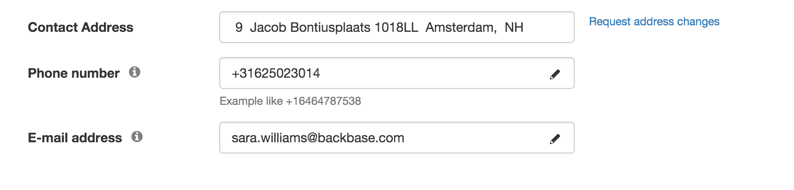

# Profile Contact
Provides an easy way for user to update his contact information. All the controls are created using the Editable Controls.

## Information
|  name |  version |  bundle |
|--|:--:|--:|
|  widget-profile-contact |  2.1.12 |  Universal |

## Dependencies

- base ^2.9.0
- core ^2.12.4
- ui ^2.4.15
- module-users ^2.5.1

## Dev Dependencies

- mock ^1.0.9
- config ^3.4.0
- theme-default ^1.0.12
- angular-mocks ~1.2.28
- requirejs ~2.1.20

## Screenshots

## Preferences

- **saveUrl**: Places Data Source

*This widget does not have any preferences.*

## Events
*This widget does not subscribe/publish to any events.*

