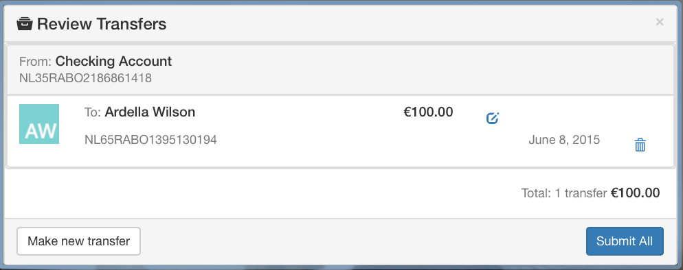

# Review Transfers
Displays a list of initialized though not submitted payment orders. It handles payment authorization. Additionally, allows the user to update and remove payments.

## Information
|  name |  version |  bundle |
|--|:--:|--:|
|  widget-review-transfers |  2.3.4 |  Banking |

## Dependencies

- base 2.x
- core 2.x
- ui 2.x
- module-accounts 2.x
- module-payments 2.x
- module-p2p ^1.0.0

## Dev Dependencies

- config 2.x
- angular-mocks ~1.2.28
- mock ~1.0.5

## Screenshots

## Preferences

- **accountsDataSrc**: Accounts Data Source
- **p2pEnrollmentEndpoint**: Enrollment Status Endpoint for P2P Service
- **paymentOrdersDataSrc**: Payment Orders Data Source
- **paymentOrdersSubmitPoint**: Payment Orders Data Source
- **pendingPaymentOrdersDataSrc**: Pending Payment Orders Data Source
- **hideFooter**: Hide footer

Get widget preference `widget.getPreference(string)`

- **accountsDataSrc**: The URL endpoint to retrieve account data
- **paymentOrdersDataSrc**: The URL endpoint to retrieve payment orders data
- **p2pEnrollmentEndpoint**: The URL endpoint to retrieve P2P enrollment status

## Events
The following is a list of pub/sub event which the widget subscribes to:

- **reviewTransfer** - When this message is received, the model is updated

The following is a list of pub/sub event which the widget publishes to:

- **launchpad-retail.requestMoneyTransfer** - Published when the Make New Transfer button is selected
- **launchpad-retail.transactions.newTransferSubmitted** - Published when a A2A or P2P transfer is submitted

